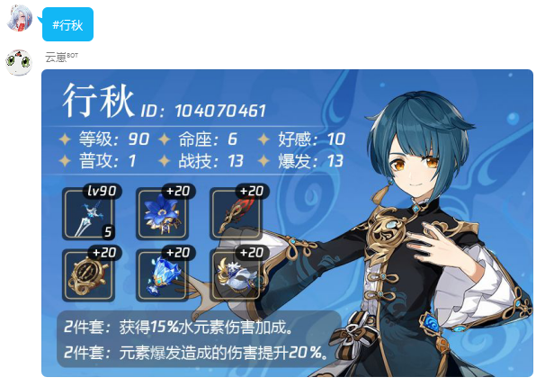
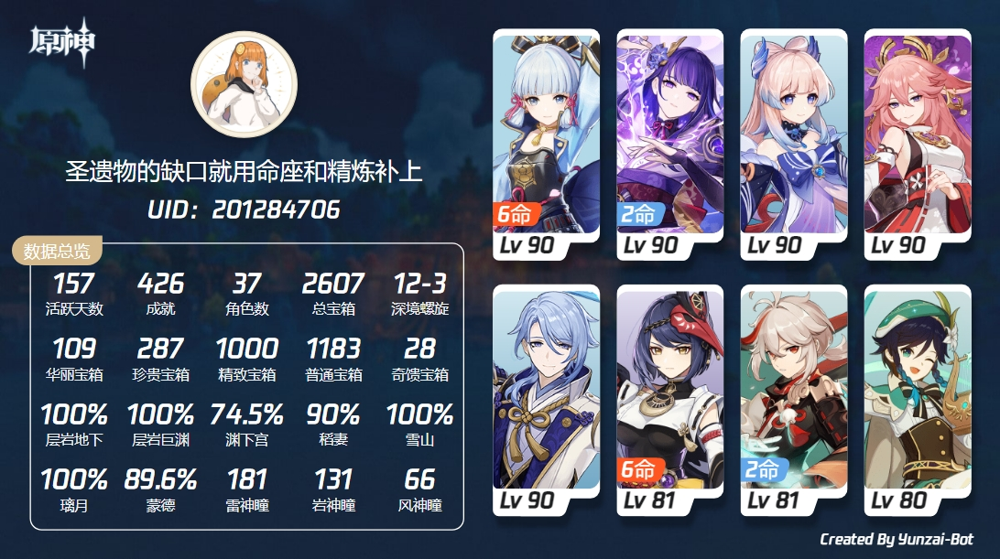
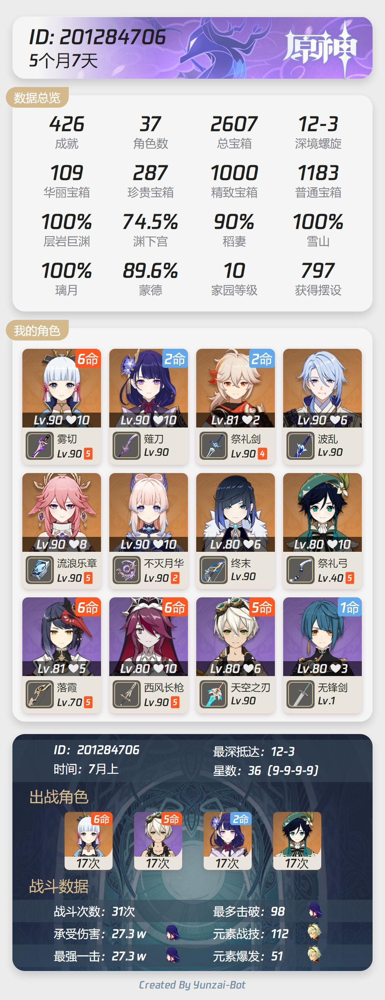
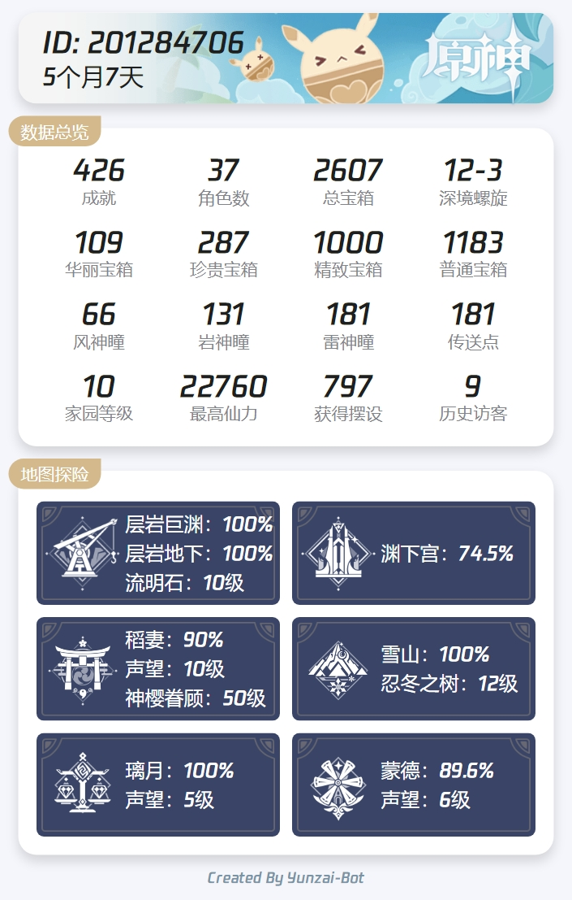
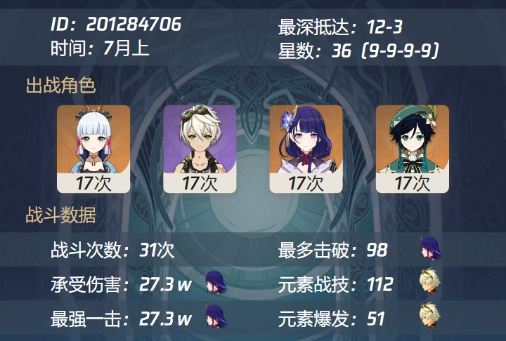
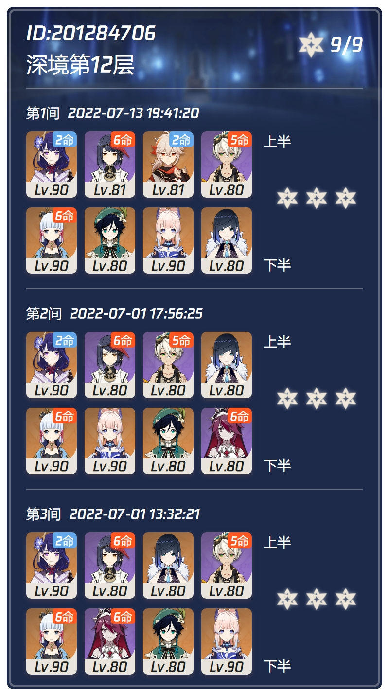
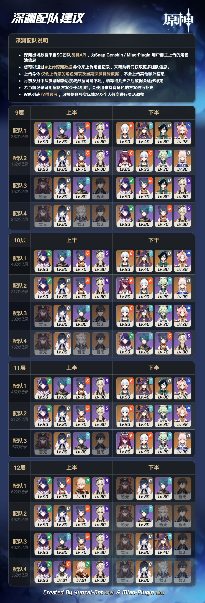

# Orange-Bot
本机器人为原神群内专属机器人，通过接受指令来执行快捷功能 
*机器人指令以井号（**#**） 开头，后面接相应的操作命令* 
*使用本机器人需要绑定你的**uid**，进阶玩法可以[绑定cookies](docs.qq.com/doc/DUWNVQVFTU3liTVlO)*

## 绑定uid
> #绑定+uid 
> 例如：   #绑定123456

成功绑定uid之后，即可开始使用机器人的功能

## 查询类功能
#### 查询角色名片    
>查看角色名片信息(天赋 武器 以及圣遗物)

    #角色名称  
    例如 #刻晴  

预览

#### 查看账号角色信息    
>**查看账号资料（米游社信息）**    
- 查看角色卡片   

       #角色卡片
    

    
预览

    
    

- 角色整体统计    

       #角色 
    

    
预览

    
    

- 探索度
        
        #探索度
    

    
预览

    
    

> **深渊查询**
- 深渊概览

        #深渊 #上期深渊
    

    
预览

    
    

- 查询深渊具体信息

        #深渊12层
    

    
预览

    
    

- 深渊配队思路

        #深渊配队
    

    
预览

    
    
